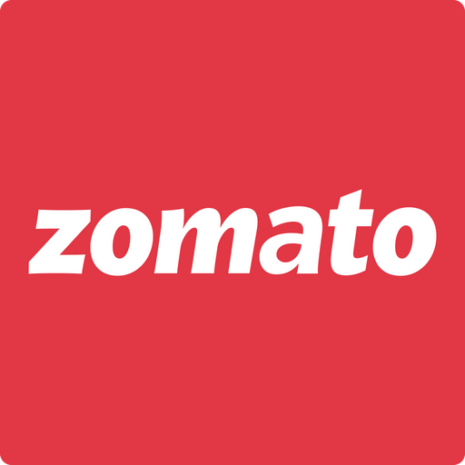
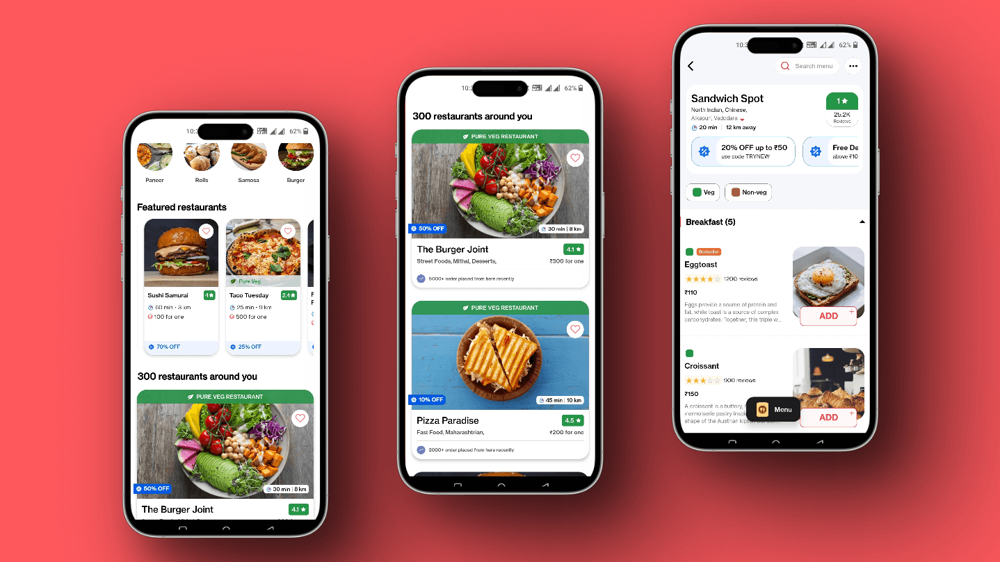

# Zomato App Clone (Food Delivery App)

## Table of contents

- [Overview](#overview)
- [Screenshots](#screenshots)
- [Run the project](#Run-the-project)
- [Built with](#Built-with)

## Overview

- Zomato is an Indian multinational restaurant aggregator and food delivery company. It provides information, menus and user-reviews of restaurants as well as food delivery options from partner restaurants in select cities.
- You will see multiple restaurants presented in different card like designs.
- To render everything beautifully, I designed a number of custom components.
- React Navigation library is used to add navigation system.
- I made an effort to mirror the design of the original app exactly.
- The app only has a frontend design at the moment, and dummy data is being pulled from a data file.

## Screenshots





## Run the project

First you need to have node and Android Studio install in your machine to run this project and app.
Clone this project and open it on any Code Editor or IDE.
Then run this command.

```
npm i
```

It will install all the dependencies in your system. Then run this command to start the server.

```
npm start
```

Now you can view this app on your Android smartphone or Android Emulator

## Built with

- React Native
- Expo
- Javascript
- React Navigation
- Styled Components
